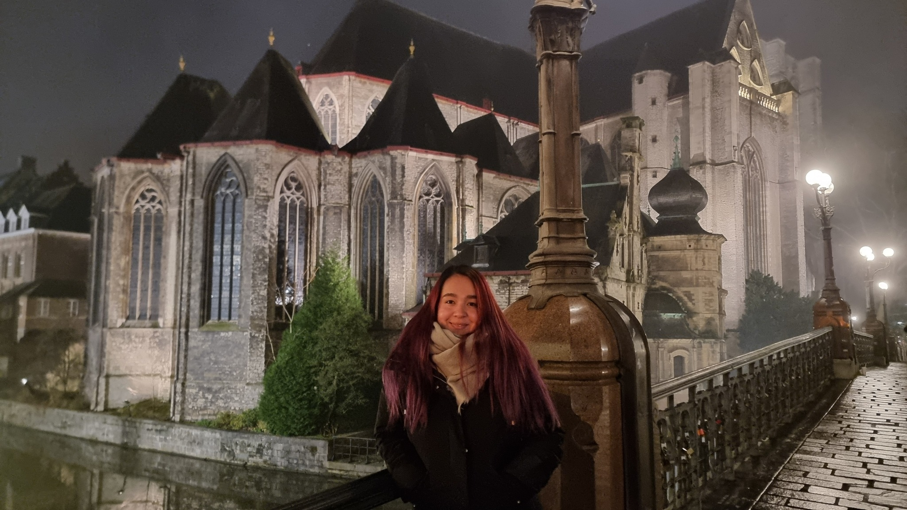

# Frontend Developers in Training 👩‍💻👨‍💻

Welcome to our GitHub page! We are a group of passionate students learning and
exploring the exciting world of frontend development. Our goal is to create
modern, user-friendly, and responsive web applications while mastering the core
technologies of the web.

## About Us ✨

We are a team of aspiring frontend developers with diverse backgrounds and a
shared enthusiasm for building engaging digital experiences. Together, we are
learning, experimenting, and collaborating to improve our skills and prepare for
real-world challenges.

## What We Are Learning 📚

- **HTML**: Structuring the web with semantic markup.
- **CSS**: Styling websites with creativity and responsiveness.
- **JavaScript**: Adding interactivity and functionality to web pages.
- **Frameworks & Libraries**: Exploring tools like React, Vue.js, and more.
- **Version Control**: Collaborating efficiently using Git and GitHub.
- **Web Design**: Understanding user experience (UX) and user interface (UI)
  design principles.

## Our Projects 🚀

Here, you’ll find a collection of our projects and assignments as we progress
through our learning journey. Each project reflects our growth and demonstrates
the new skills we’ve acquired. Some of our recent projects include:

- Interactive landing pages
- Responsive web layouts
- Basic web applications

## Get in Touch 🤝

We’re always open to feedback, collaboration, and learning from the broader
developer community. Feel free to explore our repositories and share your
thoughts.

Happy coding! 😊

## Here we are 🧑

### [_SUSANA_](./members/susana.md)

---

### [_ARSAN_](./members/arsan.md)

---

### [_ALIAN_](./members/alian.md)

---

### [_ANTON_](./members/anton.md)

---
